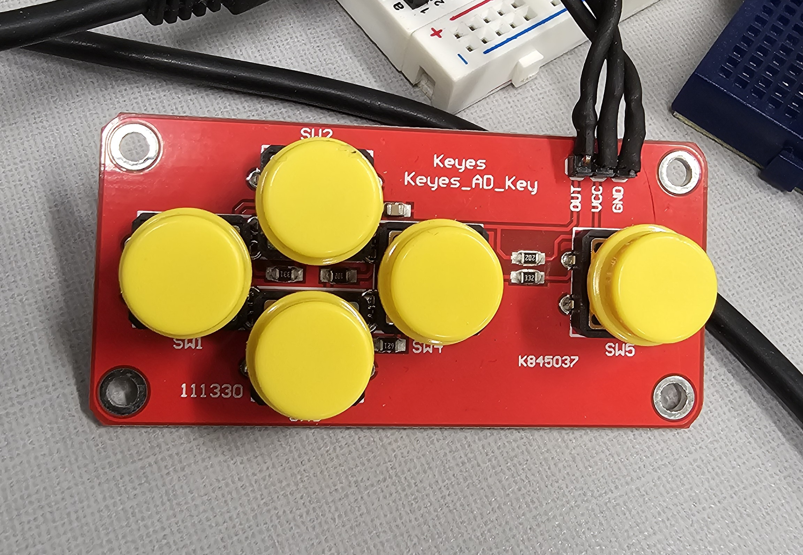
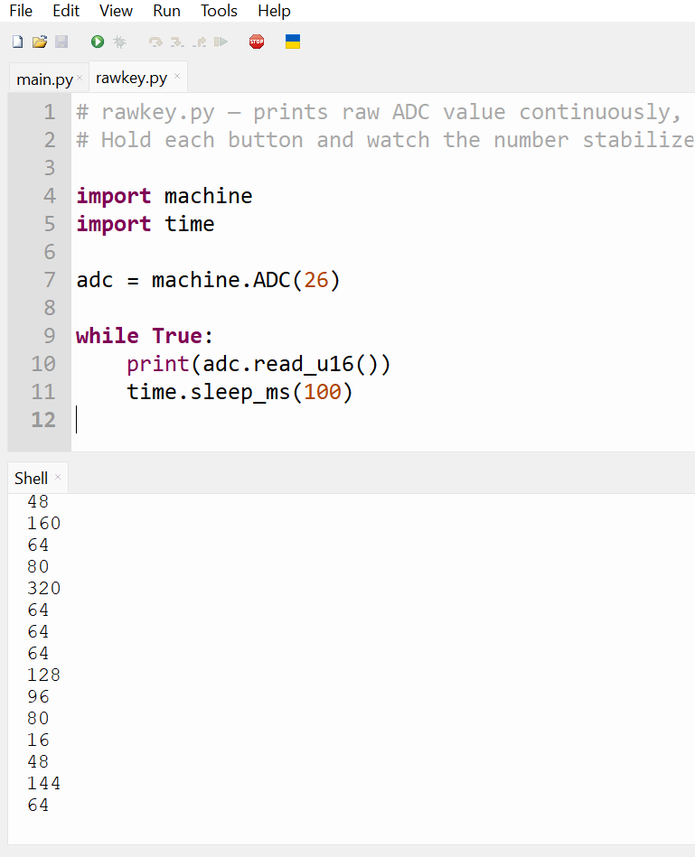

+++
title = "Working with Keyes_AD_Key"
date = 2026-04-26
draft = false
+++

I'm working on a bigger project right now that will release later, but one of the building blocks that I want to highlght is this device:



This is the Keyes_AD_Key 5 switch, 3 wire controller interface. I was interested upon seeing the low price of this item as well as the small wire count. So how does it work? The 3 pins are VCC, GND, and OUT. The OUT pin needs to be connected to an ADC pin on the microcontroller to decode which buttons are being pressed. The buttons activate different valued resistors on a resitor ladder that pulls to ground, reading the differing voltages can be decoded into the button presses.

This means that multiple simultaneous presses won't be registered accurately, but this probably won't be a problem for this use case. There are more than a few of these type of controllers, most have 5 buttons, but I've seen some with more and less. I'd like to highlight the Pi Pico's Serial debugger as the tool to solve the problem of which button press equals what output value. This is neccessary to do yourself because the resistors have slightly different values at different temps and voltages.

Fire up Thonny, whip up some quick lines of code that look like this:

```python
# rawkey.py — prints raw ADC value continuously, no filtering at all
# Hold each button and watch the number stabilize.

import machine
import time

adc = machine.ADC(26)

while True:
    print(adc.read_u16())
    time.sleep_ms(100)
```

Open up Thonny, restart the backend, run the code. The REPL in the lower part of the screen will show live (10 times per second) values of the ADC pin being read. For the controller, I'm going to call the 4 buttons in a D-pad configuration UP, DOWN, LEFT, RIGHT and the lone button on the right the Action button. To figure out what keys equal what values, just press them one at a time and remember/write it down:



As you can see, the values jump around a lot, but stay within a certain range for each button. Here's the translation I'm running with:

```python
# keys.py — Keyes_AD_Key driver for Pi Pico
# Calibrated values:
#   LEFT   ~0-500   (< 1000)
#   UP     ~9000    (6000  – 12000)
#   DOWN   ~21000   (17000 – 26000)
#   RIGHT  ~32000   (28000 – 37000)
#   ACTION ~47000   (43000 – 52000)
#   NONE   ~65535   (> 60000)
#
# Wiring:
#   VCC -> 3.3V  |  GND -> GND  |  A -> GP26
```

The surprise project I'm working on is a tiny arcade/game player. I will showcase the completed project when it's more polished, but I wanted to put out a blog post to show how to read the pin values from this interesting and cheap controller. Stay tuned for more, the next project I showcase here will be the pinHigh Arcade device.