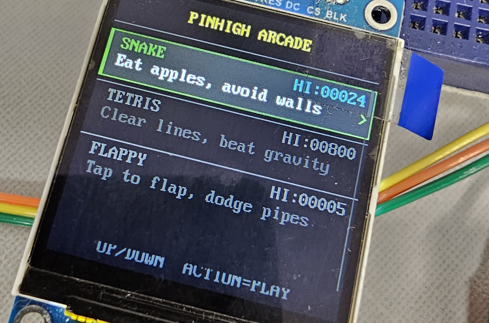
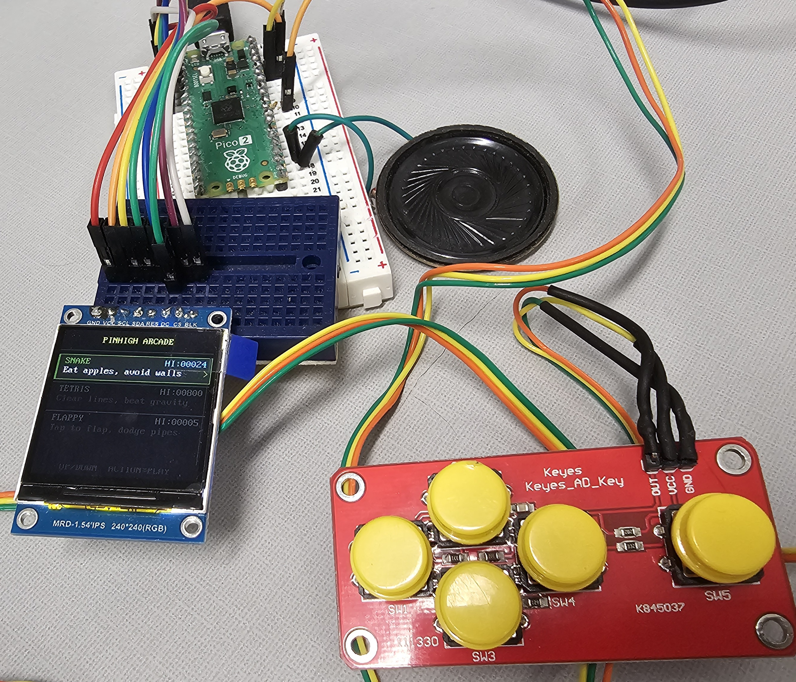
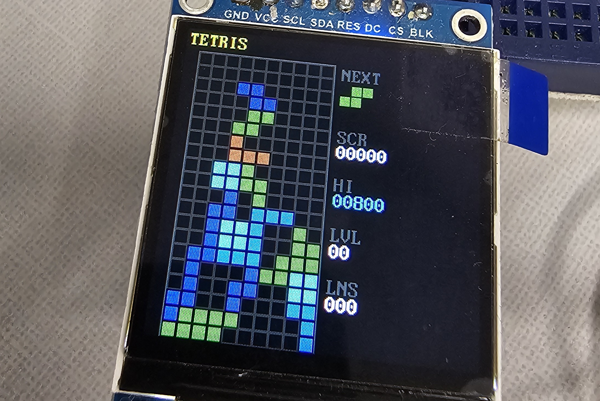

+++
title = "Mini Pi Pico arcade"
date = 2026-05-16
draft = false
+++

I'm working on a mini arcade based on the Pi Pico 2. There's much more to be done, but it's coming along enough to do a small writeup and post the code/schematics. The bill of materials:

[Pi Pico 2](https://www.sparkfun.com/raspberry-pi-pico-2.html)

[240x240 Display with ST7789 driver](https://www.icstation.com/inch-240x240-display-module-st7789-driver-240240-p-14035.html)

[Keyes AD Key 5 button analog controller](https://www.diymore.cc/products/ad-keyboard-simulate-five-key-module-analog-button-for-arduino-sensor-expansion-board-electronic-modules)

[8 Ohm speaker with a 150-220 Ohm resistor for basic sound output](https://www.jameco.com/z/MNS40H5R8M1W-Jameco-ValuePro-Round-40mm-Diameter-8-Ohm-Speaker-with-2-36-Inch-Wires-1-2W-90dB-5kHz_2499447.html)

[Breadboard](https://digilent.com/shop/half-size-breadboard/)

[Jumper Wires](https://store-usa.arduino.cc/products/breadboard-jumper-wire-pack-200mm-100mm)

Here's the schematic for connections:

Once you have the devices wired up, head over to https://github.com/bitb4nger/pinHigh_arcade and grab all the relevant code. Here's a list of all the programs and their purpose:

asteroids.py - Asteroids clone

breakout.py - Breakout clone

flappy.py - Flappy Bird clone (runs terribly at the moment)

keys.py - Translation for the key input so other games can just call "UP, DOWN, LEFT, RIGHT, and ACTION"

main.py - Main loop, this is the starting menu screen, a launcher for the individual games

rawkey.py - Test software for the analog controller input

scores.py - Save file for high scores that persists across power cycles

seaquest.py - SeaQuest clone

sfx.py - Sound handling script

snake.py - Snake clone

space_shooter.py - Space shooter (this one needs work)

st7789py.py - Driver file for the screen, tells the Pico how to draw shapes and pixels

tetris.py - Tetris clone

vga2_8x16.py - Text/font display data

You should now be able to play games while the Pico is connected to power! Try out Snake first, it's the most complete and functional currently. I think this is a cool device to learn some game programming tricks on, but some of the games aren't complete or have small errors. Flappy Bird has some redraw issues, the Asteroids clone has bullets that stick on the screen instead of being cleaned up, Tetris occasionally has a weird input error that I haven't nailed down and the space shooter is bland and boring, needs to be reworked.

Adding more games only requires a single line of code to be added to the main file for each game, I think we could fit 80+ small arcade games in the memory we have.

<video controls width="100%">
  <source src="snakeplay.mp4" type="video/mp4">
</video>

There's still much more work to be done on this, here's my to-do list:

3D print a case for the screen, speaker and Pico, separate case for the controller

Add a battery and charge controller

Add a high score screen visible from the base menu, add 4 letter names for the high scores

Reset/power button

We're using basically none of the flash memory, so MOAR GAMES!!!!

I'd like to develop a longer game for this hardware, perhaps an RPG

Add an I2C sound output, the current speaker/resistor combo is relatively quiet and also a little ghetto

I'm also not sure that I'm using the Pico 2 to it's limits, I might be better off with the cheaper Pico 1, but I will need to do some testing to verify.

I will keep working on this project from time to time, the github will have the latest versions of the games and menu code. Expect a blog post update in the future as I complete certain milestones.